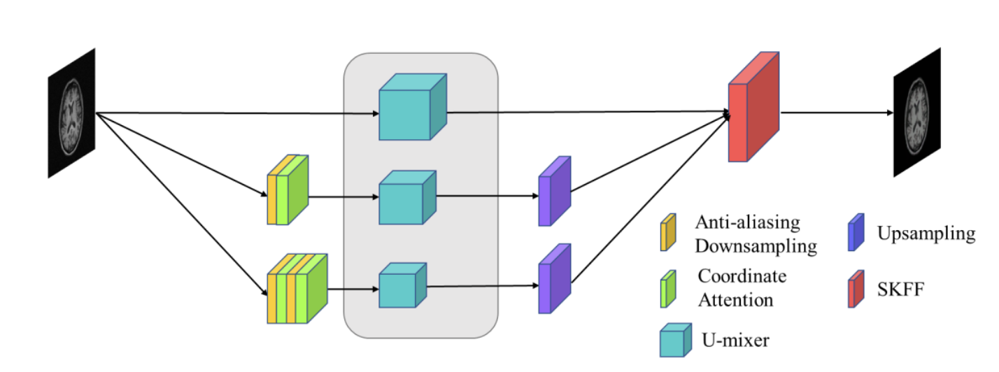
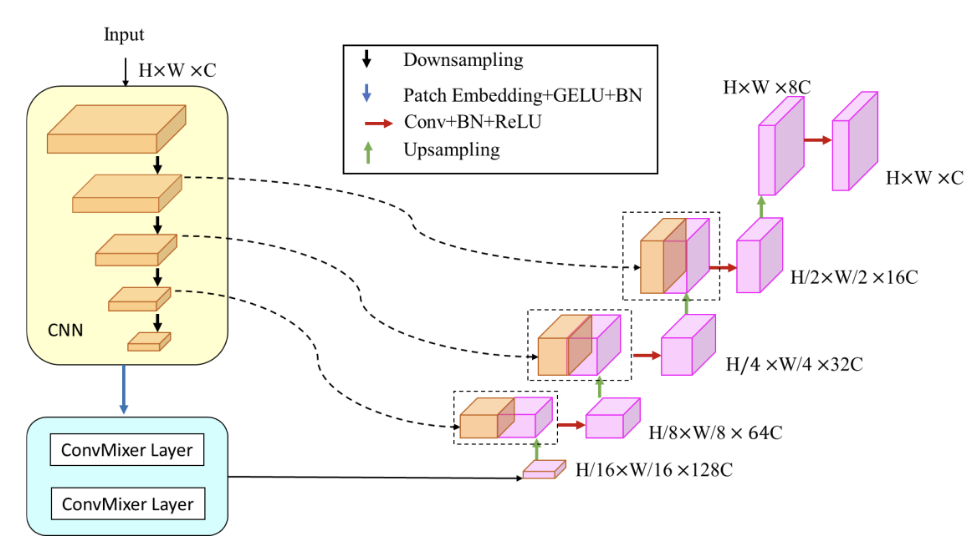
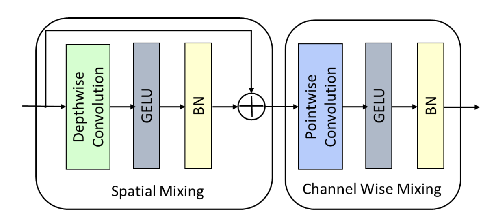
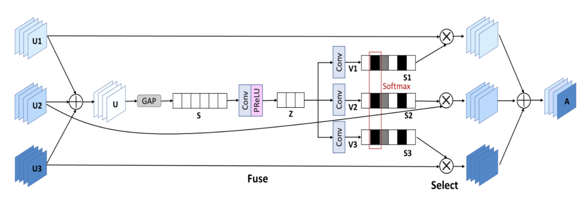

# Unet-Mixer: MRI Image Denoising

A deep learning project for **MRI image denoising** using a U-Net architecture enhanced with ConvMixer modules.

## Architecture

### Overall Network Structure



The network follows a U-Net encoder-decoder design with ConvMixer enhancement blocks (U-mixer modules) in the encoder stage. Inputs pass through multiple encoding stages with MaxPool downsampling, are refined by a ConvMixer backbone, and decoded back to the original resolution via bilinear upsampling and concatenation.

### U-mixer Module



Each U-mixer module contains a residual ConvBlock followed by a ConvMixer block. The ConvMixer applies a 1x1 convolution to expand channels (C → 2C), processes features with depthwise and pointwise convolutions (with residual connections and GELU activation), then projects back (2C → C) and merges with the ConvBlock output via element-wise addition.

### ConvMixer Layer



Each ConvMixer layer consists of a depthwise convolution (kernel size 7) with residual connection, followed by a pointwise convolution (1x1) with residual connection. BatchNorm and GELU activation are applied after each convolution.

### SKFF Module (Encoder Stage Detail)



The encoder stages use a U-mixer block structure where the input is processed by a ConvBlock (two 3x3 Conv + BatchNorm + ReLU with residual connection) and a ConvMixer block in parallel. The ConvMixer applies layer normalization, depthwise convolution (kernel 3) with residual, and GELU activation. The two paths are fused via element-wise addition.

### Key Components

| Module | Description |
|--------|-------------|
| `conv_block` | Residual convolution block: two 3x3 Conv + BN + ReLU with shortcut connection |
| `ConvMixer` | Depthwise separable convolution with residual connection (from [ConvMixer paper](https://arxiv.org/abs/2109.04451)) |
| `SKFF` | Selective Kernel Feature Fusion for multi-scale feature aggregation |
| `CyclicLR` | Cyclic Learning Rate scheduler with exponential range decay |

## Project Structure

```
Unet-Mixer/
├── models/
│   ├── model.py          # Top-level model wrapper (mymodel)
│   ├── unetmixer.py      # U-Net + ConvMixer architecture
│   ├── convmixer.py      # ConvMixer building block
│   └── skff.py           # Selective Kernel Feature Fusion
├── datasets/
│   └── dataset.py        # Train/Val/Test dataset classes
├── utils/
│   ├── metrics.py        # PSNR and SSIM evaluation metrics
│   └── lr_scheduler.py   # CyclicLR scheduler
├── tools/
│   └── turn90.py         # Data augmentation (90-degree rotation)
├── configs/
│   └── default.yaml      # Training configuration
├── train.py              # Training script
├── test.py               # Testing script
├── predict.py            # Inference script
└── requirements.txt
```

## Installation

```bash
pip install -r requirements.txt
```

## Data Preparation

Organize your MRI data as follows:

```
data/
├── train/
│   ├── DATA_noisy5/    # Noisy input images (noise level sigma=5)
│   └── DATA_clean/     # Clean ground truth images
├── val/
│   ├── DATA_noisy5/
│   └── DATA_clean/
└── test/
    ├── DATA_noisy5/
    └── DATA_clean/
```

Images should be grayscale PNG/TIF format. You can use different noise levels (e.g., `DATA_noisy3` for sigma=3).


## Usage

### Training

```bash
python train.py
```

- Trains for 100 epochs with Adam optimizer and CyclicLR scheduler
- Saves best model (`model_best.pth`) based on validation PSNR
- Saves latest model (`model.pth`) every epoch
- Plots loss curve to `loss_curve.png`

### Testing

```bash
python test.py
```

- Loads `model_best.pth` and evaluates on test set
- Reports PSNR and SSIM metrics
- Saves denoised images to `./data/result/`

### Inference

```bash
# Single image
python predict.py --input noisy.png --output denoised.png --weights model_best.pth

# Directory of images
python predict.py --input ./data/test/DATA_noisy5 --output ./data/result --weights model_best.pth

# Force CPU
python predict.py --input noisy.png --output denoised.png --device cpu
```

## Training Configuration

Default hyperparameters (see `configs/default.yaml`):

| Parameter | Value |
|-----------|-------|
| Epochs | 100 |
| Batch Size | 8 |
| Learning Rate | 1e-4 |
| Optimizer | Adam |
| Loss Function | MSE |
| LR Scheduler | CyclicLR (1e-4 ~ 4e-4, exp_range) |
| Best Model Selection | Validation PSNR |

## Evaluation Metrics

- **PSNR** (Peak Signal-to-Noise Ratio): Measures pixel-level reconstruction quality
- **SSIM** (Structural Similarity Index): Measures perceptual structural similarity

## License

This project is for research purposes.
